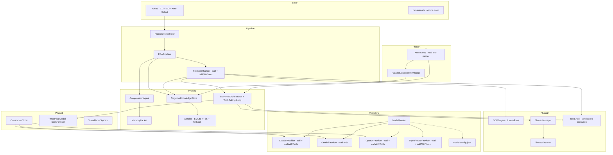
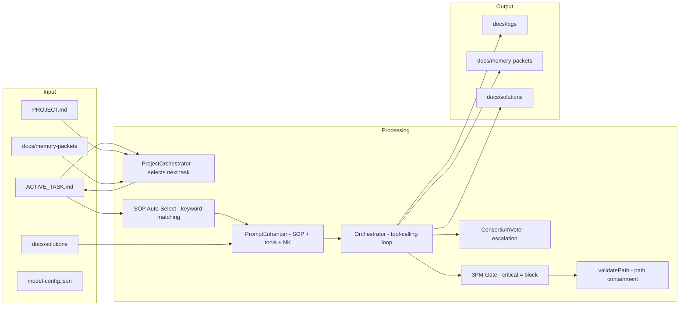
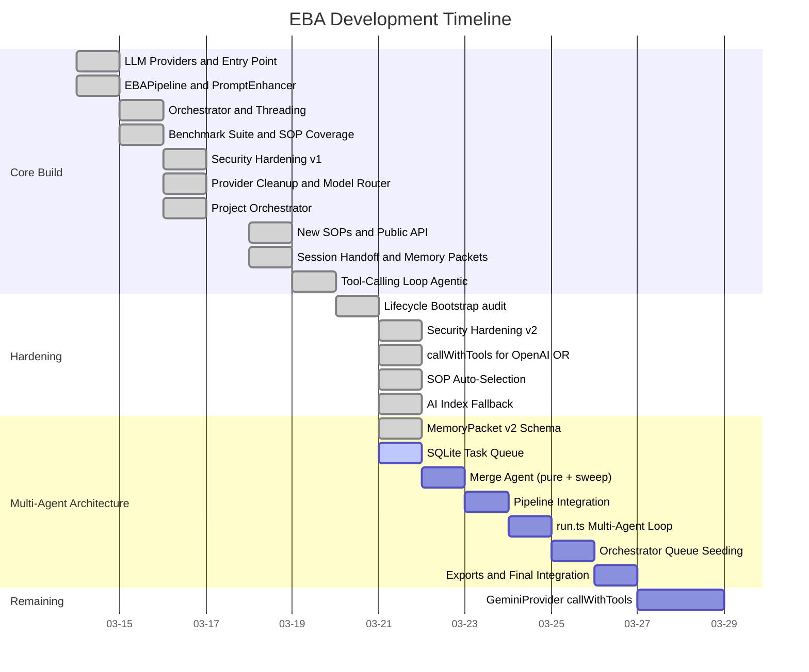

# Project Summary — Episodic Blueprint Architecture (EBA)

> Updated by /audit on 2026-03-21.

## Overview

EBA is an autonomous AI engineering system that combines deterministic orchestration with episodic memory, isolated execution threads, and multi-model safety validation. It treats the LLM like an OS kernel inside a governed execution pipeline.

**Core problems solved:** context rot, infinite loops, hallucination.

## Stack

| Component | Version |
|-----------|---------|
| TypeScript | 5.3.3 |
| Node.js | 20+ |
| Jest | 29.7.0 |
| ts-jest | 29.1.2 |
| @anthropic-ai/sdk | 0.78.0 |
| @google/generative-ai | 0.24.1 |
| openai | 6.29.0 |
| better-sqlite3 | 11.x (with in-memory fallback) |
| dotenv | 17.3.1 |

**Target:** ES2022, CommonJS modules
**Entry point:** `dist/index.js` (library), `src/run.ts` (CLI)

## Architecture Layers

1. **Phase 1 — Hybrid Memory & Context Engine:** Memory packets, negative knowledge, AI index (SQLite FTS5 with in-memory fallback), orchestrator with retry logic + agentic tool-calling loop
2. **Phase 2 — Blueprint Orchestrator:** SOP engine (9 step graphs with auto-selection), thread manager (isolated workers), tool shed (registry + sandboxed execution)
3. **Phase 3 — Validation & Safety:** Consortium voter (multi-model consensus), Three-Pillar Model (risk gating with critical-level bash controls), visual proof system
4. **Phase 4 — Auto-Research & Scale:** Arena loop (real test-runner objective), parallel negative knowledge

**Integration layer:** `EBAPipeline` connects all four phases. `PromptEnhancer` injects SOP/tools/NK context and forwards `callWithTools`. `ProjectOrchestrator` handles task planning from PROJECT.md.

## Directory Layout

```
src/                    (35 files)
  phase1/               memory-packet, negative-knowledge, ai-index, compression-agent, orchestrator
  phase2/               sop, sop-library, thread-manager, thread-executor, tool-shed
  phase3/               consortium-voter, three-pillar-model, visual-proof
  phase4/               arena-loop, parallel-negative-knowledge
  pipeline/             eba-pipeline, prompt-enhancer, project-orchestrator
  providers/            claude, gemini, openai, openrouter, model-router, benchmark-updater, model-config.json
  benchmark/            run-benchmark, sop-coverage, task-corpus
  utils/                shell-test-runner, token-counter
  run.ts                CLI entry point (with SOP auto-selection)
  run-arena.ts          Arena loop entry point (real test-runner wired)
  scheduler.ts          Benchmark scheduler
  index.ts              Public API barrel export
tests/                  (27 files, 229 tests)
docs/
  PROJECT.md            High-level architecture description
  ACTIVE_TASK.md        Current task: fix platform portability
  memory-packets/       Compressed session JSON outputs (7 packets)
  solutions/            Negative knowledge markdown store
  logs/                 Execution logs
  kamakazi/             Integration probe notes
lifecycle/
  gate-state.json       Lifecycle state tracker
  journal/              Gate journal entries
  reviews/              Harden review reports
  audits/               Audit reports
  solutions.md          Curated solutions
  patterns-reference.md Codebase patterns
  project-summary.md    This file
```

## Current State

**Branch:** main (+ uncommitted security/portability fixes)
**Latest committed:** 0b988e7 (2026-03-19) feat: implement tool-calling loop
**Uncommitted changes:** 14 files covering security hardening (path traversal, command injection), callWithTools for OpenAI/OpenRouter, SOP auto-selection, arena real test-runner, ai-index fallback, KNOWN_GOOD_MODELS externalized
**Active task:** Fix platform portability (ai-index fallback, cross-platform tool executors)
**Development span:** 2026-03-14 to 2026-03-21 (8 days, 20 commits + pending)

### Test Health
- **229 tests across 27 suites:** 219 passing, 10 failing
- **ai-index.test.ts (10 failures):** better-sqlite3 native module not compiled for Win32. The fallback path has its own passing test (ai-index-fallback.test.ts).
- **tool-executor.test.ts:** Now passing (fixed by /harden)
- **Typecheck:** Clean (no errors)
- **CVEs:** 0 vulnerabilities

### Dependency Health
- @anthropic-ai/sdk 0.78.0 to 0.80.0 available (minor)
- openai 6.29.0 to 6.32.0 available (minor, in-range)
- better-sqlite3 11.x to 12.8.0 available (major)
- jest 29.x to 30.3.0 available (major)
- @types/jest 29.x to 30.0.0 available (major)
- @types/node 20.x to 25.5.0 available (major)

## Recent Learnings

- **Import from source modules:** With isolatedModules + strict, types must be imported from their defining module.
- **PromptEnhancer must forward callWithTools:** Decorator wrappers that only implement call() silently break the agentic tool-calling loop.
- **Path containment is essential for LLM tool execution:** Without validatePath(), the LLM can read/write anywhere on the filesystem.
- **Command allowlists over sanitization:** For bash_execute, a prefix allowlist is more reliable than trying to sanitize arbitrary shell commands.
- **Use execFileSync with args arrays:** Eliminates the entire category of shell injection vs string interpolation.

## Open Risks

- **better-sqlite3 platform incompatibility:** Native module fails on Win32. The fallback path works but FTS5 search quality is reduced to linear scan.
- **GeminiProvider lacks callWithTools:** Only provider without tool-calling support. Will throw if Gemini is primary and the tool-calling loop is used.
- **No CLAUDE.md:** Project has no project-level CLAUDE.md for contributor guidance.
- **Uncommitted work:** 14 files of security + portability fixes are uncommitted.

## System Architecture



## Data Flow



## Progress Gantt


